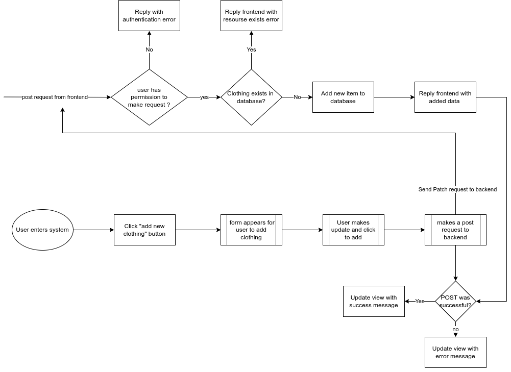
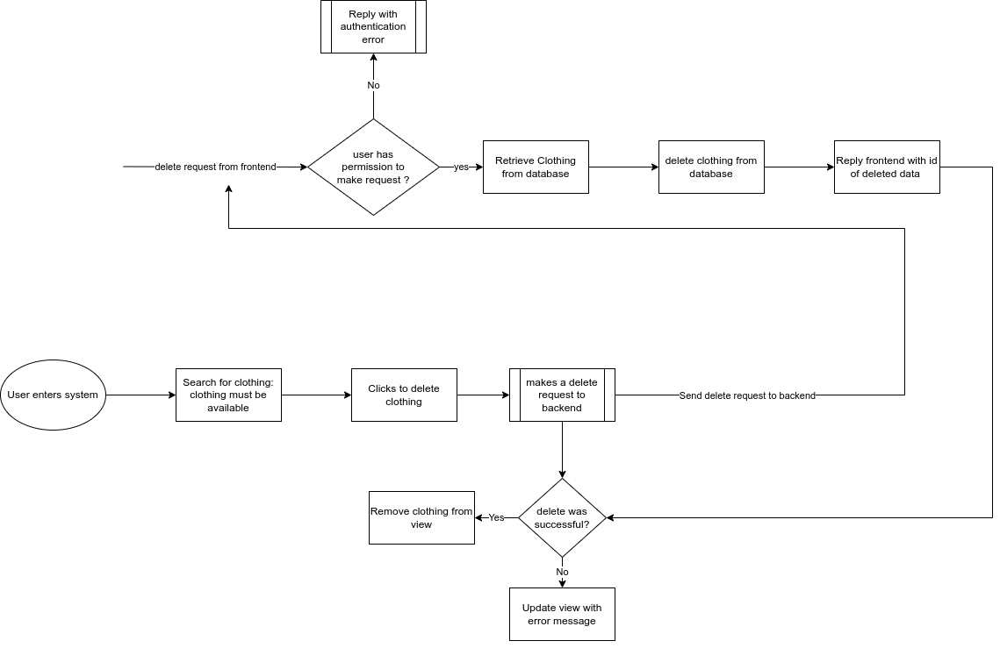
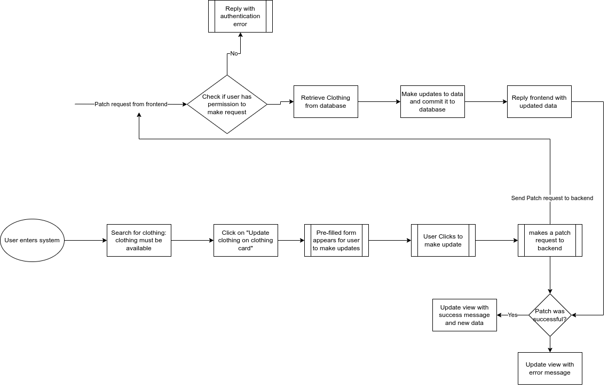

# FinalFashion

This is a joint project undertaken by a subsection of scholars of the ALX-T Fullstack Web Developer Nanodegree program.  
The goal of this application is to help students apply the knowledge they got from the Fullstack Udacity nano degree.

## Purpose

It is meant to be a Clothing Shop that will be built from the ground up, incorporating relevant aspects of the program, with an opportunity to do team-collaboration.

## Developers

TODO: List developers
[Louis Marie Atoluko Ayariga](https://www.linkedin.com/in/marieloumar/)

TODO: Add more sections here onwards

## Links

[github link](https://github.com/EddyQay/finalfashion)

## The process

### Built with

For now, since we have not yet planned, we do not yet know the technologies we will use. This will be updated later. But we will use the following technologies because those are what we learned in the nanodegree:

#### Backend

- Python
- Flask
- Postgres
- AUTH0

#### Containerization

- docker

#### Deployment

TODO: discuss deployment technologies

#### Frontend

TODO: discuss frontend technologies

## General Description

### Major Components of the Application

Authentication
Customer
Manager
Order
Cart
Messaging
Item

### Users and Roles

There are 2 main users of the application. They are listed below with their roles. This will be useful when configuring AUTH0

Manager:

1. Create a Manager account
2. Log into account
3. Add items if it does not exist
4. Optionally update item if it exist
5. Delete an item
6. View order information

Customer:

1. Create a Customer account
2. Log into account
3. View items
4. Add item to cart
5. Remove item
6. Proceed to checkout
7. Confirm order
8. Recieve an email confirmation for order

===============================

## Clothing Categories

There are 2 broad categories of people we will target: Men and Women.

- Major categories:

  - Trousers
  - Dresses
  - Shoes

Clothing/Major Categories:

- Men:

  - Shirts
  - Trousers
  - Shoes

- Women:
  - Shirts
  - Trousers
  - Dresses
  - Shoes

### The application should be able to do the following:

1. App should send emails of orders

Customer:

1. Create an account with Customer role
2. Update Clothing in cart
3. Delete Clothing from cart
4. Retrieve clothing details
5. Add to Cart
6. Place order
7. Sort items in (alphabetically)
8. Filter by clothing category (Men/Women/Clothing type/_Shops_)
9. Remove item from cart
10. ** Create feedback **
11. Add comments on items

Manager:

1. Add items to shop

   

2. Delete item from shop

   

3. Update items in shop

   

4. Read items in shop
5. Can see items purchased for auditing

===================================================

## What we learned

TODO: whenever we learn something new, we will add it here

## improvement notes

TODO: if we come across anything we were not taught in the nanodegree, we will add them here with useful links so we can inform Udacity about them or share them with our colleagues so they can learn them.

## Useful links

TODO: useful links can be put here for easy reference.

## Notes

The name was suggested by Louis Marie, and seconded by a few others. If you have any opinions about the said name, kindly post your recommendations in \*_general_ slack channel.
